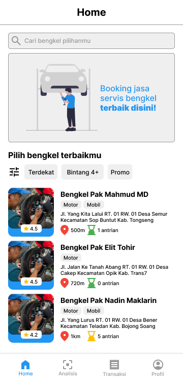

<!-- PROJECT LOGO -->
<br />
<div align="center">
  <a href="Logo Bangkit">
    
  </a>

  <h3 align="center">BENGKELIN</h3>

  <p align="center">
    An application that can predict tire conditions and display the nearest repair shop.
    <br />
  </p>
</div>
<br>
<div align="center">
  <a href="Logo Bangkit">
    
  </a>
</div>

<!-- ABOUT THE PROJECT -->

## About The Project

Our team is developing a mobile app that uses machine learning to detect tire quality, recommends vehicle workshops, and provides automotive care advice. Our aim is to enhance road safety by raising awareness about tire condition and maintenance, and gworth the SMEs Economic of the Vehicle Workshop. Many vehicle owners lack knowledge about tire quality and struggle to find suitable spare parts and workshops. Our solution will address these issues with a user friendly interface and comprehensive features.

## TEAMS

- M299DSX2926 - Rafiq Ramadhan - Universitas Pancasila - Machine Learning - [active]
- M299DSX0285 - N.I.S. Baldanullah - Universitas Pancasila - Machine Learning - [active]
- C265DSX0666 - Mochammad Ridwan - Universitas Muria Kudus - Cloud Computing - [active]
- C265DKY4234 - Salum Ainayya Alfatikhah - Universitas Muria Kudus - Cloud Computing - [active]
- A299DSX2287 - Muhammad Rizky Fadhillah - Universitas Pancasila - Mobile Development - [active]
- A062DSX2274 - Dwitio Ahmad Pranoto - Politeknik Negeri Jakarta - Mobile Development - [active]

## TECH STACK

- Node JS
- Express JS
- Flask
- Python
- MySQL Database

## Getting Started

1. Clone the backend
   ```sh
   git clone https://github.com/your_username_/Project-Name.git
   ```
2. Dwonload machine learning model
   ```link
   https://drive.google.com/drive/folders/1ZxJEnUIdWLq3ppA8NKQod_gRYmQTDgAg?usp=drive_link
   ```
3. Change database `src/configs/dbConnection.js`

   ```js
   const conn = mysql.createConnection({
     host: "", // Replace with your host name
     user: "", // Replace with your database username
     password: "", // Replace with your database password
     database: "", // // Replace with your database Name
   });
   ```

4. Copy model file in `machineLearning folder`
5. Install dependencies
   ```sh
   npm install
   ```
6. Migration database
   ```sh
   npx sequelize-cli db:migrate
   ```
7. Run
   ```sh
   node server.js
   ```
